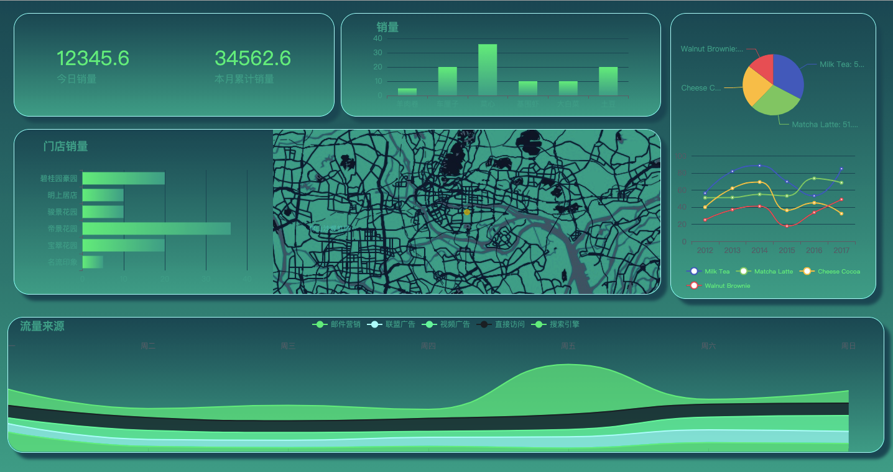
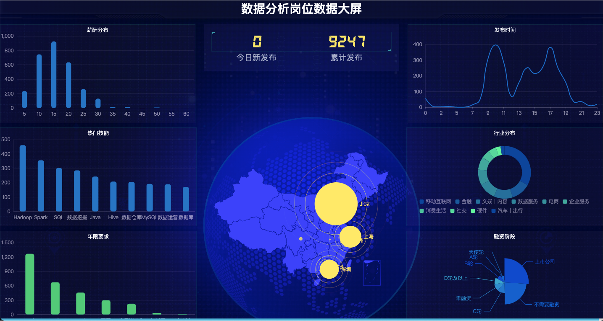

# 数据学习

## SQL

1. [力扣SQL70题解](sql/%E5%8A%9B%E6%89%A3)

## 爬虫  

1. [lagou](spider/lagou)
2. [滑块验证码](spider/captcha.py)
3. [dclab爬虫](spider/dclab.py)
4. [巨量引擎-sign](spider/juliang.py)
5. [千帆APP排行榜](spider/qianfan.py)
6. [验证码轨迹模拟--缓动函数](spider/滑动验证之轨迹插值（贝塞尔曲线）.md)

## 数据库

1. [python通过ssh跳板机链接SQLserver](database/connect.py)

## 深度学习

1. [阿里天池-新闻分类](deeplearn/newclassification_base_bert.ipynb)
    赛题以新闻数据为赛题数据，按照字符级别进行匿名处理。划分14个分类类别：财经、彩票、房产、股票、家居、教育、科技、社会、时尚、时政、体育、星座、游戏、娱乐的文本数据。训练集20w条样本，测试集A包括5w条样本，测试集B包括5w条样本。
    模型结果线上F1 0.9557，排名15（2020-12-16）
2. [阿里天池-复购预测](ml/competition/repeat_buy02.ipynb)

## 数据可视化

1. [echarts可视化demo](https://wyaming89.github.io/datav)
    
2. [数据分析岗位数据可视化](http://139.199.77.47/)
    

## 书签备份
